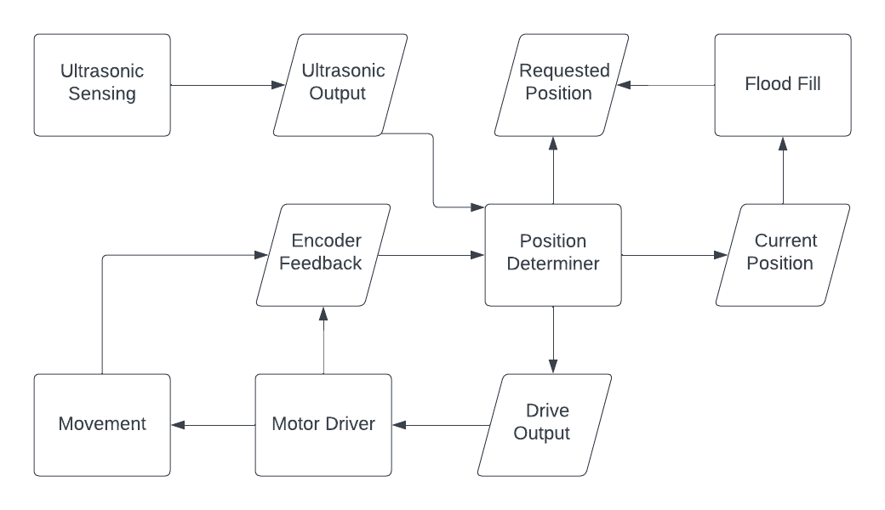
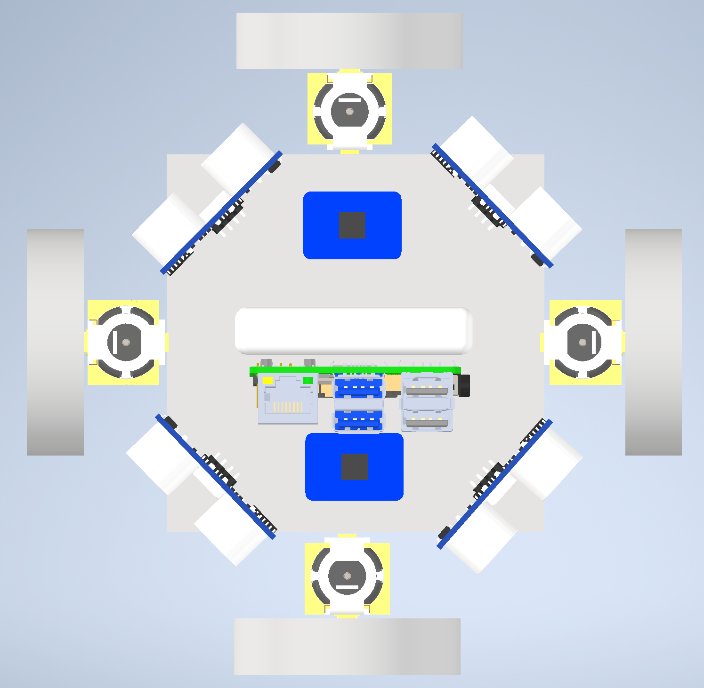

# Microbull Proposal

## Overview

The overview should be a general description of your project. This should be a high level overview of your design decisions and how you will implement them, including detailed information on how you will handle difficulties such as software and hardware integration. This should also contain information on the hardware including references to the electrical requirements of all the individual components of your system and how those requirements will be managed. You should also discuss what kind of software you will be running, undergo a brief analysis to show you have the compute power to run your software, and discuss how the software will use the inputs your hardware gives it to complete its task. 

### Software Plan
The Microbull will be programmed using Python 3 and ROS2. We will be using ROS2 controller libraries to interface with the motors. There will be ROS2 nodes for: the maze-solving algorithm (which will be using floodfill), the position-determining algorithm, and the motor-control algorithm. The nodes will communicate over the following ROS topics: current position, requested position, drive output, and encoder feedback. 

The __Node__ Position Determiner will: output to __Topic__ `current position`, output to __Topic__ `drive output`, listen to __Topic__ `requested position`, listen to __Topic__ `encoder feedback`. 

The __Node__ Motor Driver will: output to __Topic__ `encoder feedback`, listen to __Topic__ `drive output`. 

The __Node__ Flood Fill will: output to __Topic__ `requested position`, listen to __Topic__ `current position`. 

### Hardware Plan
In order to make sense of the hardware plan for the Microbull, components shall be introduced in terms of voltage requirements, physical dimensions, communication protocol, function, and how they interface to other components.

1. __Raspberry Pi 4 Model B:__
    * Input Voltage: 5V @ 3A
    * Output Voltage: 3V3 @ 50mA
    * Dimension: 85.60 * 56.5 * 17.0 mm
    * Communication: GPIO for sensors and motor drivers.
    * Function: This is the "brain" of the Microbull. It's responsible for processing data from the ultrasonic sensors, controlling gearbox motors, and making decisions.

2. __Ultrasonic Sensor:__
    * Input Voltage: 5V @ 15mA
    * Output Voltage: 3V for __Trigger__ signal and 5V for __Echo__ signal
    * Dimension: 40.0 * 18.0 * 15.0 mm
    * Communication: Trigger and Echo pins for communication with the Raspberry Pi using a pulse-based protocol for distance measurement.
    * Function: Detect objects and obstacles, and measure distances using ultrasonic waves.

3. __Motor Drivers:__
    * Input Voltage: 6V @ 1A
    * Output Voltage: 6V @ 1A
    * Dimension: 26.0 * 18.0 * 3.0 mm
    * Communication: GPIO and PWM signal for speed and direction pins.
    * Function: Control the direction and speed of the gearbox motors. Convert logic-level (3V3) control signals from the Raspberry Pi to motor power (6V).

4. __Power Bank:__
    * Input Voltage: 5V @ 2A
    * Output Voltage 5V @ 2.1A
    * Dimension: 90.0 * 63.0 * 12.5 mm
    * Communication: N/A
    * Function: provide portable power for the Raspberry Pi, sensors, and motor drivers.

5. __DC-DC Converter:__
    * Input Voltage: 5V @ 1.6A
    * Output Voltage 6V @ 1.2A
    * Dimension: 8.13 * 13.08 mm
    * Communication: N/A
    * Function: Steps up the voltage to provide regulated power to the motor driver.

6. __Gearbox Motors:__
    * Input Voltage: 6V @ 150mA
    * Output Voltage: N/A
    * Dimension: 70 * 22 * 18 mm
    * Communication: N/A
    * Function: Drive wheels for Microbull's movement.

#### Interface
* The Raspberry Pi communicates with the ultrasonic sensors using GPIO pins for trigger and echo pins.
    * Based on the sensor data, the Raspberry Pi calculates navigation command for the motors and sends control signals to the motor drivers using GPIO pins and PWM for speed control.
* Motor drivers control the direction and speed of the motors, which in turn move the Microbull based on the Raspberry Pi's instructions.
* The power bank supplies power to the Raspberry Pi and other components directly, while the DC-DC converter regulates voltage for the motor driver.

## Flowchart of System Design

## Parts and Costs

### Purchases

| Item Name w/Link | Cost per Unit | # of Units | Total Cost |
| ---- | ---------------- | ---- | ---------------- |
| [Rasberry Pi 4B 4GB](https://www.digikey.com/en/products/detail/raspberry-pi/SC0194-9/10258781) | $55.00 | 1 | $55.00 |
| [Ultrasonic Distance Sensor - 3V or 5V - HC-SR04 compatible - RCWL-1601](https://www.adafruit.com/product/4007) | $3.95 | 4 | $15.80 |
| [USB Li-Ion Power Bank with 2 x 5V Outputs @ 2.1A - 5000mAh](https://www.adafruit.com/product/4288) | $26.95 | 1 | $26.95 |
| [DC Gearbox Motor - "TT Motor" - 200RPM - 3 to 6VDC](https://www.adafruit.com/product/3777?gad_source=1) | $2.95 | 4 | $11.80 |
| [Adafruit DRV8833 DC/Stepper Motor Driver Breakout Board](https://www.adafruit.com/product/3297) | $5.95 | 2 | $11.90 |
|[4942 - Non-Isolated PoL Module DC DC Converter 1 Output 6V 1.4A 1.3V - 16V Input](https://www.digikey.com/en/products/detail/pololu-corporation/4942/19235996)|$4.95|1|$4.95|
|[USB-AP-S-RA - USB 2.0 Plug Connector](https://www.digikey.com/en/products/detail/adam-tech/USB-AP-S-RA/9832306)|$0.55|2|$1.10|
| | | **Total** | **$127.50** |

### Custom Creation

1. Wheels - 3D printed.
3. Chassis - 3D printed.
4. Compute Casing for Raspberry Pi and battery - 3D printed.

### Parts on Hand

1. Wires
2. Breadboard

## 3D Model

Our model consists of a basic square chassis, four motors attached to gearboxes, two H-Bridge Stepper Motor Drivers,
a Raspberry Pi 4, an Adafruit battery bank, four ultrasonic sensors, and four wheels. The wheels on the model only represent the size and occupation area of the real wheels which will be mecanum wheels.

Isometric View:

Top-Down View:

## Teammates and Responsibilities

### Eric 
Will create the ROS2 software setup. Will program the sensing, control, and maze-solving algorithms. Will test the program. 

### Ben   
Will assist in python programming for the software stack including software-hardware integratino with the motors and encoders. Will manage the power supply circuitry and the motor control circuitry. Responsible for ensuring that the Arduino and motor controllers are both properly powered from the battery but are on separate circuits with the proper voltages and currents. 

### Jared
Responsible for 3D modelling and 3D printing of parts including the omniwheels, the chassis, and the holders for the Pi and power pack. Responsible for wiring and manging circuitry. 

### Margaret
Responsible for wiring and manging circuitry. Will manage the power supply circuitry and the motor control circuitry. Responsible for ensuring that the Arduino and motor controllers are both properly powered from the battery but are on separate circuits with the proper voltages and currents. 

## Milestones

### Milestone Set 1: 11/8/23

* Get GPIO output from the pi to light up LEDs on a breadboard. 
* Get GPIO input from the pi to read button presses on a button.
* Get GPIO input from the pi to read sensor data from the ultrasonic sensors.
* Initial 3D Model for chassis completed.

### Milestone Set 2: 11/22/23
* Get the algorithm working in simulation. 
* Positioning algorithm can properly identify where mouse is within a single maze cell.
* Can make the motors spin from the battery.

### Milestone Set 3: 11/29/23
* Pi can make the motors spin in both directions. 
* Pi can read sensor data and calculate the position of the mouse when moving thorugh corridors of the maze. 
* Firmware can control the motors and receive input from encoders to properly move the mouse as instructed.
* Mouse can move forward, backward, to the left, and to the right. 

### Milestone Set 4: 1/10/24
* Mouse can move in a straight line and stop when it reaches an obstacle.
* Mouse can turn 90 degrees when told to by the algorithm.
* Mouse can move for 10 minutes straight. 
* Mouse can execute different algorithms based on user inputs from physical buttons on the mouse. 
* Flood fill working on Rasberry Pi in firmware and works in simulation. 

### Milestone Set 5: 1/24/24
* Mouse can move through a maze randomly without hitting walls.

### Milestone Set 6: 2/7/24
* Mouse can solve the maze. 

